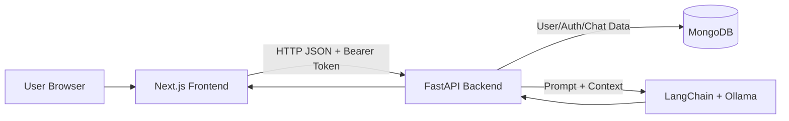
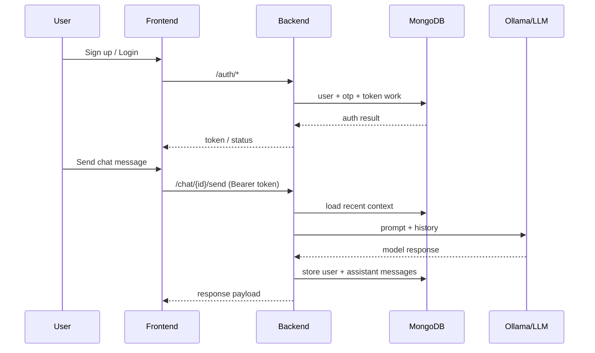

# LinguaMentor

<p align="center">
  
</p>

A full-stack AI language mentor you can run locally and improve as a serious engineering project.

This repository is a strong portfolio project because it combines:
- production-style authentication with OTP and JWT
- multi-conversation chat experience
- FastAPI backend + Next.js frontend
- MongoDB persistence
- LLM integration through Ollama/LangChain

---

## Quick Demo View


The app lets a user sign up, verify by OTP, log in, create chats, and continue learning conversations in a clean interface.

---

## Why This Project Stands Out

Most tutorial apps stop at a single endpoint and static UI. This codebase goes further:

- Handles auth lifecycle: signup, OTP verification, login, profile, password reset.
- Stores chat conversations and message history per authenticated user.
- Protects chat routes with bearer token validation.
- Splits concerns into routes, services, models, dependencies, and utilities.
- Ships with a modern frontend ready for iterative product improvements.

This is exactly the kind of practical software engineering scope recruiters look for in early-career backend/full-stack candidates.

---

## System Architecture



### Runtime Flow



---

## Tech Stack

### Backend
- Python 3.12+
- FastAPI
- MongoDB (PyMongo)
- JWT auth
- bcrypt password hashing
- LangChain ecosystem + Ollama

### Frontend
- Next.js (App Router)
- React + TypeScript
- Tailwind CSS
- Axios
- Radix UI primitives

---

## Repository Structure

```text
LinguaMentor/
├── app/
│   ├── core/                # config and database setup
│   ├── dependencies/        # auth dependency injection
│   ├── models/              # LLM prompt/core model logic
│   ├── routes/              # /auth and /chat API routes
│   ├── services/            # chat/auth business logic
│   └── utils/               # jwt, security, title generation
├── frontend/
│   ├── src/app/             # Next.js routes (auth + chat)
│   ├── src/components/      # UI and chat components
│   └── public/              # local assets used in README/UI
├── main.py                  # FastAPI entrypoint
├── requirments.txt          # backend dependencies
└── README.md
```

---

## API Surface

### Authentication Routes
- `POST /auth/signup`
- `POST /auth/verify-otp`
- `POST /auth/login`
- `POST /auth/forget-password`
- `POST /auth/change-password`
- `GET /auth/me`

### Chat Routes
- `POST /chat/new`
- `POST /chat/{conversation_id}/send`
- `GET /chat/list`
- `GET /chat/{conversation_id}`
- `DELETE /chat/{conversation_id}`

---

## Local Setup

## 1) Clone

```bash
git clone <your-fork-or-repo-url>
cd LinguaMentor
```

## 2) Backend Setup

```bash
python -m venv .venv
source .venv/bin/activate
pip install -r requirments.txt
```

Create a `.env` file in project root:

```env
JWT_SECRET_KEY=replace_with_a_strong_secret
```

Start backend:

```bash
uvicorn main:app --reload --host 0.0.0.0 --port 8000
```

## 3) MongoDB

Make sure MongoDB is running at:

```text
mongodb://127.0.0.1:27017/
```

Database and indexes are initialized from `app/core/database.py` on startup.

## 4) Frontend Setup

```bash
cd frontend
npm install
npm run dev
```

Frontend default URL:

```text
http://localhost:3000
```

Backend default URL consumed by frontend:

```text
http://localhost:8000
```

---

## Screens and UX Coverage

- Landing page
- Signup
- OTP verification
- Login
- Forgot password
- Chat list sidebar
- Conversation page with persisted chat history

The frontend includes reusable components and a clear route layout to support fast iteration.

---


