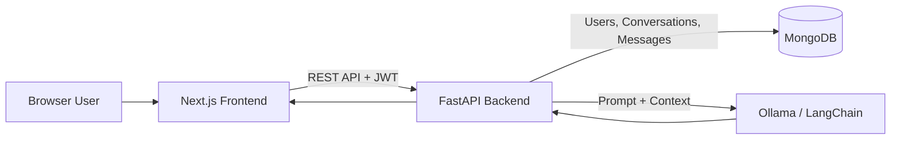
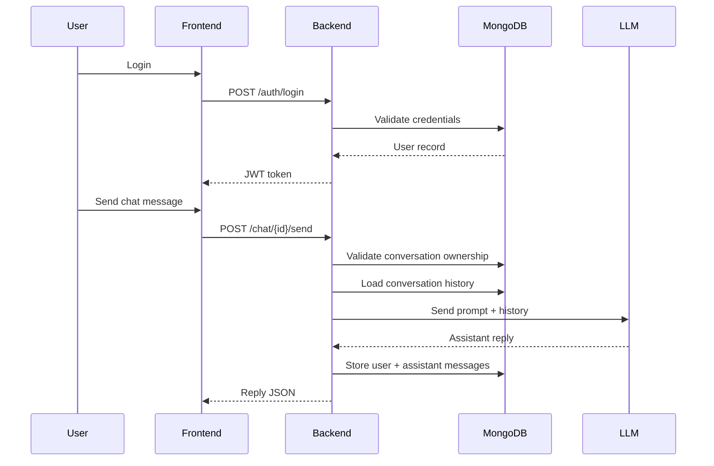

# LinguaMentor


<p align="center">
  
</p>

LinguaMentor is a full-stack application for language practice. A user creates an account, verifies OTP, logs in, and chats with an AI mentor. Each chat is saved as a conversation so the user can return later and continue.

---

## Demo


---

## What This Project Does

### 1) Authentication
- Signup endpoint accepts email, username, and password.
- OTP verification endpoint completes signup.
- Login endpoint returns a JWT bearer token.
- Forgot-password flow sends OTP and allows password reset.
- `/auth/me` returns current profile data for the logged-in user.

### 2) Chat
- User creates a new conversation with `/chat/new`.
- User sends messages to `/chat/{conversation_id}/send`.
- Backend validates ownership of each conversation.
- Messages are stored in MongoDB and can be loaded with `/chat/{conversation_id}`.
- Conversations are listed with `/chat/list` and deleted with `/chat/{conversation_id}`.

### 3) LLM Response Pipeline
- User message is passed into chat builder services.
- Recent history is loaded and assembled into prompt context.
- Model response is generated through Ollama/LangChain integration.
- User and assistant messages are persisted in the messages collection.

---

## Architecture



## Request Flow



---

## Tech Stack

### Backend
- Python
- FastAPI
- PyMongo
- JWT
- bcrypt
- LangChain + Ollama

### Frontend
- Next.js
- React
- TypeScript
- Tailwind CSS
- Axios

---

## Folder Guide

```text
LinguaMentor/
├── main.py                       # FastAPI entrypoint and router registration
├── app/
│   ├── routes/
│   │   ├── auth.py              # Auth endpoints
│   │   └── chat.py              # Chat endpoints
│   ├── services/                # Business logic (signup, signin, chat, reset)
│   ├── dependencies/
│   │   └── auth_dependency.py   # Bearer token auth dependency
│   ├── core/
│   │   ├── config.py            # Model and token settings
│   │   └── database.py          # Mongo connection + collections/indexes
│   ├── models/                  # Prompt templates / model core logic
│   └── utils/                   # JWT/security/title utilities
└── frontend/
    ├── src/app/                 # Next.js pages (auth and chat)
    ├── src/components/          # UI components
    ├── src/lib/api.ts           # Axios client with auth header interceptor
    └── public/                  # Static assets
```

---

## API Endpoints

### Auth
- `POST /auth/signup`
- `POST /auth/verify-otp`
- `POST /auth/login`
- `POST /auth/forget-password`
- `POST /auth/change-password`
- `GET /auth/me`

### Chat
- `POST /chat/new`
- `POST /chat/{conversation_id}/send`
- `GET /chat/list`
- `GET /chat/{conversation_id}`
- `DELETE /chat/{conversation_id}`

---

## Local Setup

### 1. Backend

```bash
python -m venv .venv
source .venv/bin/activate
pip install -r requirments.txt
```

Create `.env` in project root:

```env
JWT_SECRET_KEY=your_secret_key_here
```

Start backend server:

```bash
uvicorn main:app --reload --host 0.0.0.0 --port 8000
```

### 2. Database

Run MongoDB locally on:

```text
mongodb://127.0.0.1:27017/
```

The app initializes database/collections on startup in `app/core/database.py`.

### 3. Frontend

```bash
cd frontend
npm install
npm run dev
```

Open:
- Frontend: `http://localhost:3000`
- Backend: `http://localhost:8000`

---

